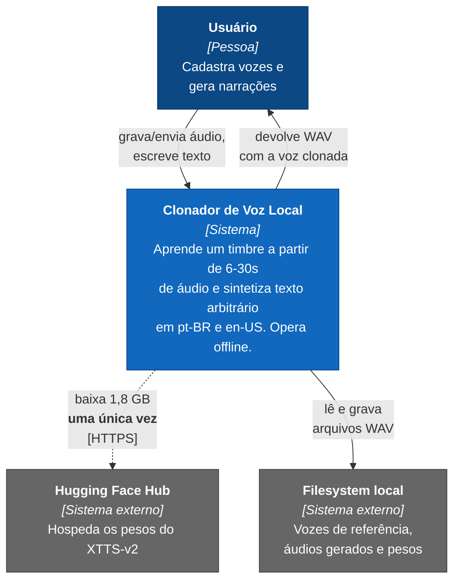
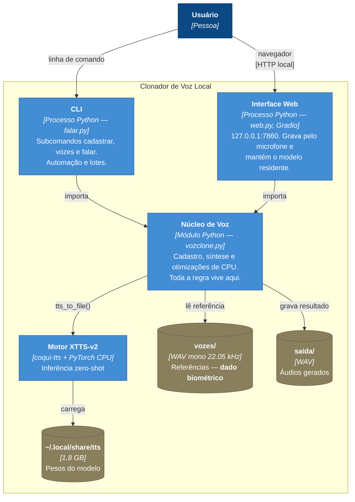
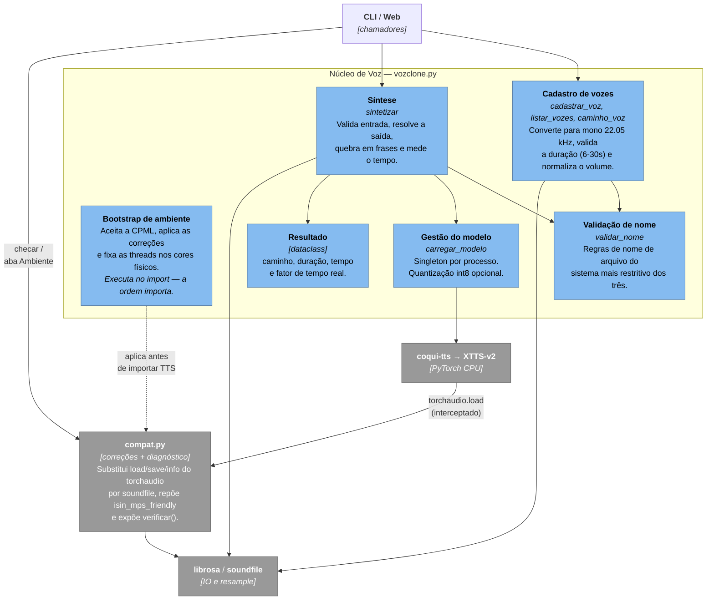
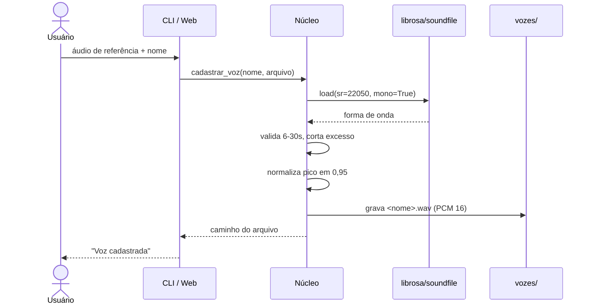
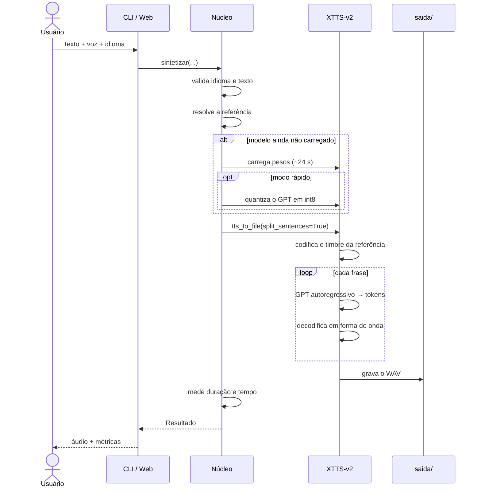

# Modelo C4 — Clonador de Voz Local

**Versão 1.0**

Arquitetura descrita segundo o [modelo C4](https://c4model.com/) de Simon Brown,
nos níveis 1 (Contexto), 2 (Contêiner) e 3 (Componente). O nível 4 (Código) é
omitido: o sistema tem quatro módulos e o próprio código, comentado, cumpre esse
papel.

Os diagramas usam Mermaid e renderizam no GitHub e em editores compatíveis.

---

## Nível 1 — Contexto

Como o sistema se encaixa no mundo. O ponto central é o que **não** aparece:
não há serviço em nuvem, API externa nem banco de dados remoto no fluxo normal
de operação.

A linha tracejada para o Hugging Face é o **único** acesso à rede, e acontece
apenas no primeiro uso. Depois disso o sistema funciona com a máquina
desconectada.

---

## Nível 2 — Contêiner

As unidades executáveis e os depósitos de dados. "Contêiner" aqui é a unidade de
execução do C4, não um contêiner Docker — todos rodam como processos locais.

O desenho é deliberadamente simples: **as interfaces são casca fina sobre o
núcleo**. Nem a CLI nem a web contêm regra de negócio, o que permite adicionar
uma terceira interface sem tocar na lógica ([ADR-0007](../adr/0007-interfaces-cli-e-web.md)).

---

## Nível 3 — Componente (Núcleo de Voz)

O interior de `vozclone.py` e suas dependências diretas.

Três pontos merecem atenção nesse nível.

**O bootstrap executa no import e tem ordem obrigatória.** A CPML é aceita, o
patch de IO é aplicado e as threads são fixadas *antes* de `TTS` ser importado.
Inverter essa ordem faz a clonagem falhar com um erro de biblioteca compartilhada
([ADR-0003](../adr/0003-io-audio-via-soundfile.md)).

**A seta de volta do XTTS para o `compat`** é o que justifica o patch existir:
o motor chama `torchaudio.load` internamente para ler a voz de referência, e é
exatamente essa chamada que estava quebrada.

**A seta direta das interfaces para o `compat`** é o diagnóstico: `verificar()`
confere, em tempo de execução, que os patches estão ativos e que os wheels
certos foram instalados. É o que `falar.py checar` e a aba "Ambiente" da web
expõem, e torna explícito um acoplamento que antes era só convenção.

---

## Fluxos principais

### Cadastro de uma voz

A conversão acontece **uma vez, no cadastro**. A partir daí toda referência
guardada já está no formato que o motor espera.

### Síntese de fala

A quebra em frases (`split_sentences=True`) não é cosmética: sem ela, textos
longos consomem memória de forma insustentável em CPU.

---

## Decisões relacionadas

| Elemento do diagrama | ADR |
|---|---|
| Motor XTTS-v2 | [0001](../adr/0001-motor-tts-xtts-v2.md) |
| PyTorch CPU-only | [0002](../adr/0002-pytorch-cpu-only.md) |
| `compat.py` — IO de áudio | [0003](../adr/0003-io-audio-via-soundfile.md) |
| `compat.py` — `isin_mps_friendly` | [0009](../adr/0009-transformers-5-por-reposicao-de-simbolo.md) |
| Validação de nome, detecção de cores | [0010](../adr/0010-portabilidade-tres-plataformas.md) |
| Bootstrap — threads | [0005](../adr/0005-threads-cores-fisicos.md) |
| Gestão do modelo — int8 | [0006](../adr/0006-quantizacao-int8-opcional.md) |
| CLI e Web | [0007](../adr/0007-interfaces-cli-e-web.md) |
| `vozes/` no filesystem | [0008](../adr/0008-vozes-como-arquivos-locais.md) |
