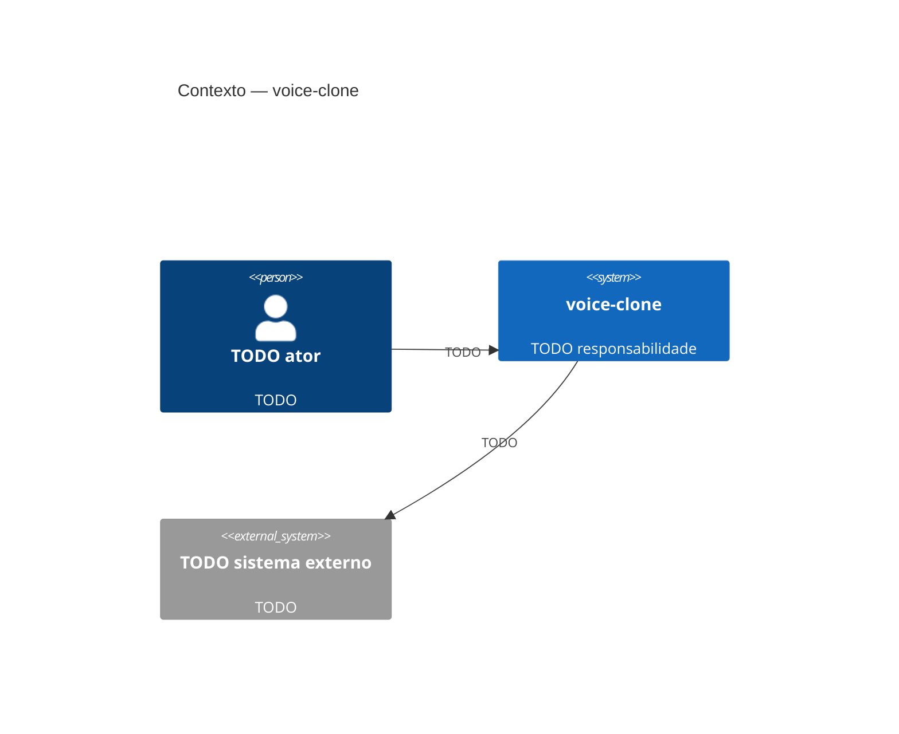

# C4 nível 1 — Contexto

TODO: uma linha — o que este sistema é, para quem.

Nível: sistema inteiro como uma caixa, mais quem o usa e com o que ele conversa.
**Nada de container ou tecnologia aqui** — isso é `02-container.md`.

## Público e responsabilidade

| Ator | Tipo | Por que interage |
|---|---|---|
| TODO | pessoa / sistema | TODO |

## Diagrama

## Fora de escopo

TODO: o que este sistema deliberadamente não faz.

## Ligações

- Containers: [`02-container.md`](02-container.md)
- Decisões que moldam este nível: TODO `../decisions/NNNN-*.md`
