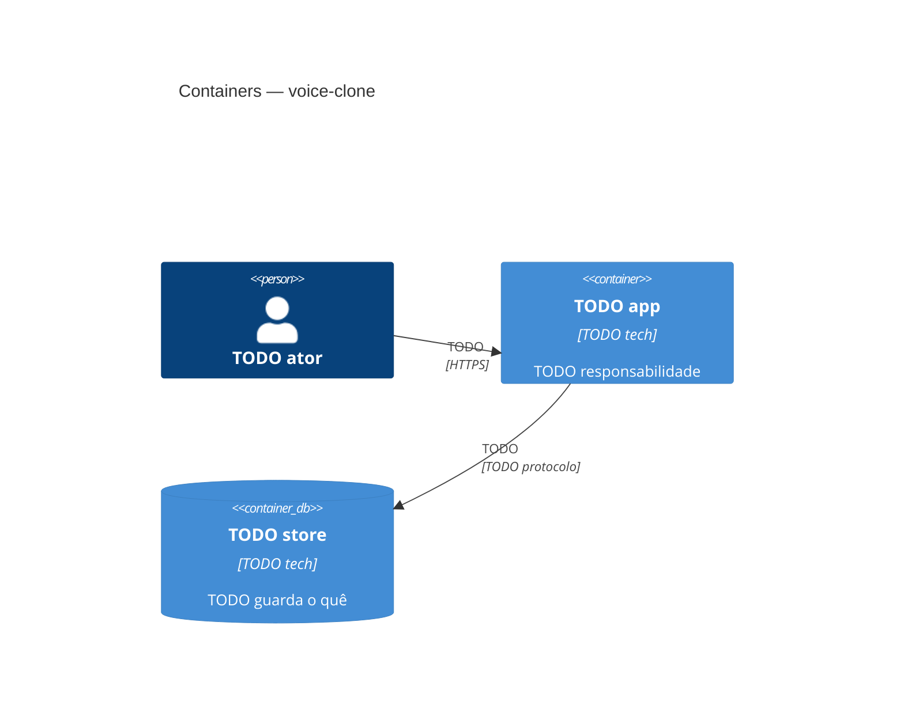

# C4 nível 2 — Containers

TODO: uma linha — como o sistema se divide em unidades executáveis.

Nível: aplicações, serviços, bancos e filas, com a tecnologia de cada um e o protocolo
entre eles. **Sem detalhe interno de container** — isso é `03-component.md`.

## Containers

| Container | Tecnologia | Responsabilidade | Fala com |
|---|---|---|---|
| TODO | TODO | TODO | TODO |

## Diagrama

## Ligações

- Contexto: [`01-context.md`](01-context.md) · Componentes: [`03-component.md`](03-component.md)
- Decisões de tecnologia: TODO `../decisions/NNNN-*.md`
