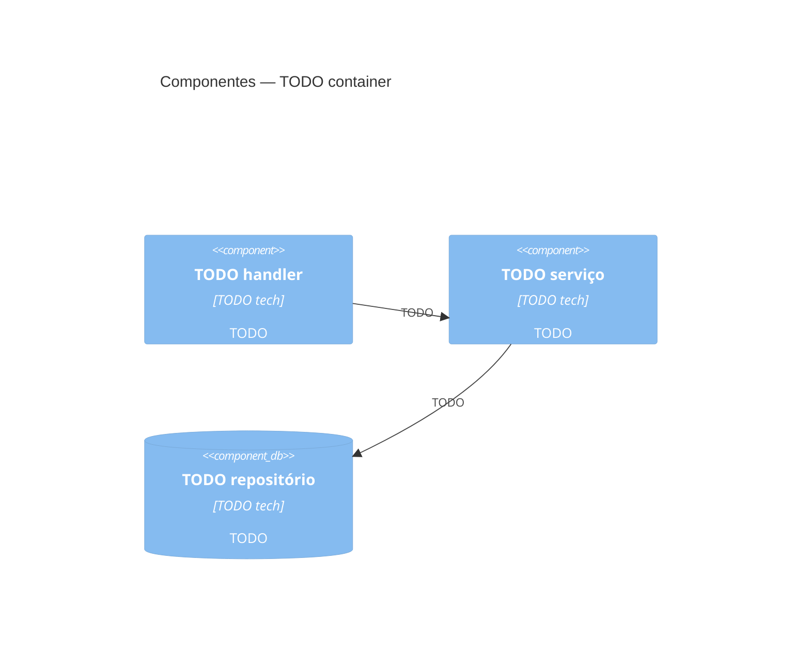

# C4 nível 3 — Componentes

TODO: uma linha — de qual container este documento abre a tampa.

Nível: os blocos dentro de **um** container e como colaboram. Um documento por
container quando houver mais de um; nomeie o arquivo por container.
**Sem código** — isso é `04-code.md`, que só existe onde se paga.

## Componentes de `TODO container`

| Componente | Responsabilidade | Depende de |
|---|---|---|
| TODO | TODO | TODO |

## Diagrama

## Ligações

- Containers: [`02-container.md`](02-container.md)
- Specs que descrevem estes componentes: TODO `../specs/*.md`
