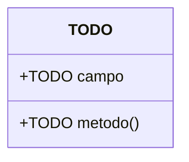

# C4 nível 4 — Código

TODO: uma linha — qual componente merece este nível, e por quê.

**Este documento é opcional.** Só exista onde o detalhe se paga: um algoritmo não
óbvio, uma máquina de estados, um contrato de dados que o código não explicita.
Na dúvida, apague o arquivo — o código é a fonte da verdade e não se narra.

## Recorte

Componente: TODO. Motivo de documentar: TODO.

## Diagrama

## Invariantes

TODO: o que sempre tem de valer, e o que quebra se não valer.

## Ligações

- Componentes: [`03-component.md`](03-component.md)
