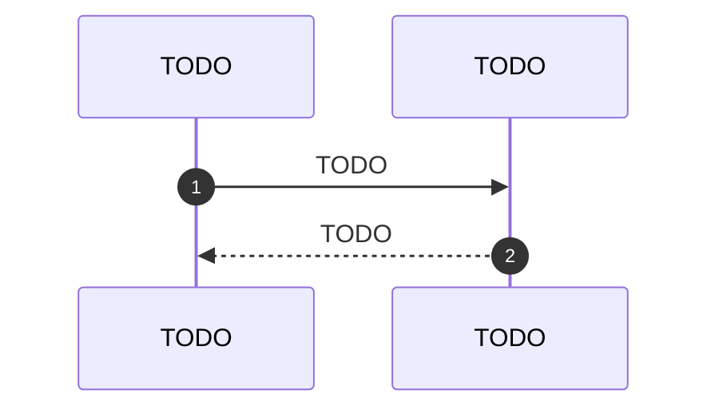

# SDD — example-capability

TODO: uma linha — a capacidade que esta spec projeta.

Um arquivo por capacidade. Nunca misture com ADR (a decisão vive em
`../decisions/`) nem com C4 (a estrutura vive em `../architecture/`).

| Campo | Valor |
|---|---|
| Estado | rascunho / em revisão / aprovada / implementada |
| Dono | TODO |
| ADRs que a restringem | TODO `../decisions/NNNN-*.md` |
| Nível C4 afetado | TODO `../architecture/0N-*.md` |

## Problema

TODO: o que dói hoje, para quem, e como se mede a dor.

## Escopo

Dentro: TODO.
**Fora**: TODO — a lista de fora é a que evita retrabalho.

## Requisitos

| # | Requisito | Tipo | Aceitação |
|---|---|---|---|
| R1 | TODO | funcional / não-funcional | TODO como se verifica |

## Projeto

TODO: como funciona. Diagrama em Mermaid quando o texto não basta.

## Dados e contratos

TODO: formato de entrada e saída, esquema, versionamento, compatibilidade.

## Alternativas consideradas

| Alternativa | Por que não |
|---|---|
| TODO | TODO |

## Plano de teste

TODO: o que provar e com qual comando. Sem "testar manualmente".

## Questões abertas

- [ ] TODO
